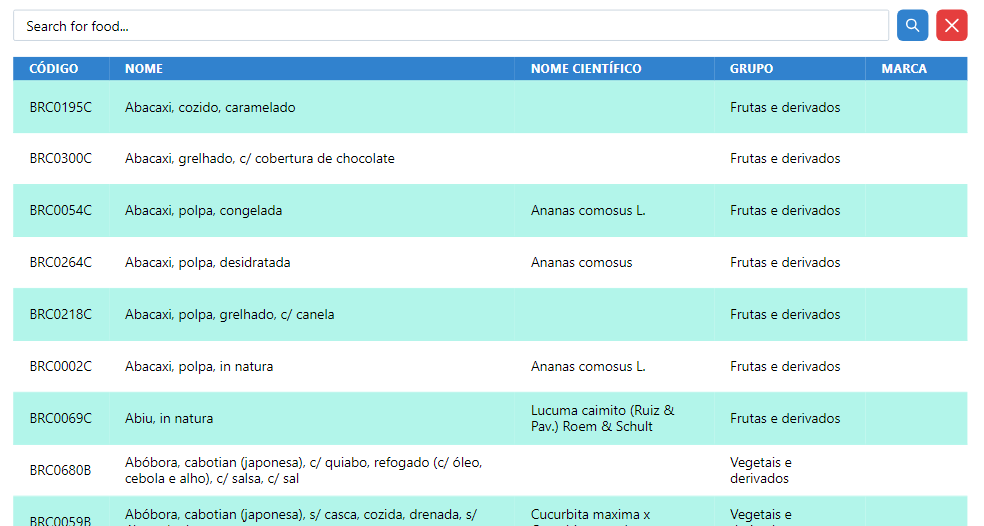
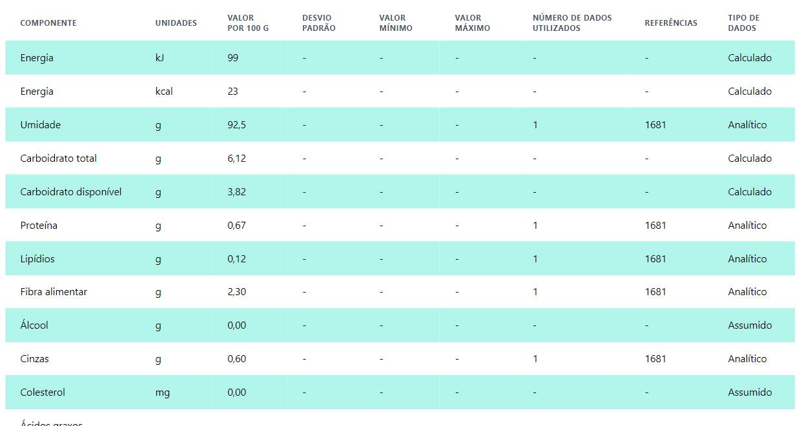

# Web Scrapping com C# .NET

### Scraping realizado no site
- `https://www.tbca.net.br/base-dados/composicao_estatistica.php`

## Funcionalidades

- Script de raspagem de dados
- Armazena dados em banco de dados
- Interface de usuário para consumir dados salvos no banco
- Pesquisa por dados salvos
- Pagina de detalhes 

---

<details open>
<summary>Pagina Home</summary>
<br>
Ligh mode
<br><br>
</img>
</details>

---


<details>
<summary>Pagina Details</summary>
<br>
Ligh mode
<br><br>
</img>
</details>

---

## Pré-requisitos

- **.NET 6** Necessuário instalar o .NET 6, para seguir a instalação seguir [documentação](https://dotnet.microsoft.com/pt-br/download/dotnet/6.0)
- **Postgress** Necessário uma instancia do servidor rodando localmente para armazenamento de dados.
- **Node** Necessário node v20.11.1 Para seguir a instalação seguir [documentação](https://nodejs.org/en)

- **Opcional**:
  - Caso opte em não rodar o banco localmente necessario o docker instalado para subir um container docker configurado.

## Start Application Back end


Clone o repositorio com:
 ```sh
 git clone <ssh|https>
 ```

Entre no projeto backand:

```sh
cd WebScrapping-C/backend
```

### Passos para Inicialização
1. Execute o comando para restaurar as dependências:

```sh
  $ dotnet restore
```

2. Execute a inicialização do banco de dados:
```sh
 $ dotnet ef database update
```

3. Certifique se que o banco de dados `postgres` esteja rodando localmente na porta `5432` e configurado com a senha de dev `123456` e usuário `postgres` . Obs: Caso opte poderar subir um container configurado no projeto com o comando:

```sh
 $ docker compose up -d
```

4. Compile o projeto com:

```sh
$ dotnet build
```

5. Rode o back end com:

```sh
$ dotnet run
```

## Start Application Front end

Entre no projeto frontend:
```sh
cd WebScrapping-C/backend
```

1. Execute o comando para instalar as dependências:
```sh
  $ npm run install
```

2. Execute o comando para iniciar a aplicação em modo development:
```sh
  $ npm run dev
```


2. Acesse a aplicação nos seguintes endereços:
   - **Frontend:** [http://localhost:3000](http://localhost:3000)
   - **Backend Api** [http://localhost:7289](http://localhost:7289)
   - **Api Doc** [https://localhost:7289/swagger/index.html](https://localhost:7289/swagger/index.html)


  ### Comandos Adicionais API

- **Subir uma nova migration**

```bash
 $ dotnet ef migrations add <new-migration-name>
```
- **Executar Back end em modo dev**
```bash
 $ dotnet watch run
```

  ### Comandos Adicionais DB

- **Remover Todos os Volumes Associados aos Containers:**
```bash
 $ docker-compose down -v
```
- **Executar Comando em um Container em Execução:**
```bash
  $ docker-compose exec -it <nome_do_servico> <comando>
```
- **Verificar Status dos Containers:**
```bash
 $ docker compose ps
```

- **Limpar Dados DB**
```bash
 $ docker compose down
```

### Organização em Monorepo
- O projeto é estruturado em um único repositório, facilitando o gerenciamento e a integração das diferentes partes.


## Melhorias Adicionais Pendentes
 wip

#### Dark mode and Light mode:
- key local history
> `chakra-ui-color-mode`\
> value: light\
> value: dark

Dependencias .net
```sh
- htmlagilitypack
- entityframeworkcore.design
- entityframeworkcore.postgresql
- diagnostics.tools
```